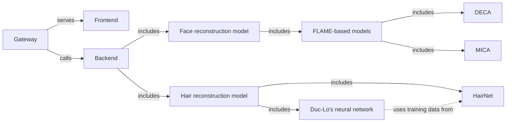

# Face & hair reconstruction from a single image server

> **Note:** MICA and HairNet are still in development and not yet integrated.

## Project structure


## Installation

### 1. Clone the repository
```bash
git clone https://github.com/itvkist/vkist-3dface.git
cd vkist-3dface
```

### 2. Create and activate a virtual environment
```bash
conda create -n vkist-3dface python=3.10
conda activate vkist-3dface
```

### 3. Install dependencies
```bash
pip install -r requirements.txt
pip install chumpy --no-build-isolation
```

### 4. Download FLAME model data

Download the FLAME model content from:
https://drive.google.com/file/d/1CDaHntz1Z-nFW5G7YfwKIKB6rcWgXz9R/view?usp=sharing

Then unzip it into `services/DECA/data/`:
```bash
unzip deca_vkist-3dface.zip -d services/DECA/data/
```

## Running the services

Activate the environment in each terminal before running:
```bash
conda activate vkist-3dface
```

### DECA service (port 11200)
```bash
python ./services/DECA/demos/demo_server.py
```

### Gateway server (port 8000)
```bash
python server.py
```

## Use the UI

Go to: http://localhost:8000/upload-ui
